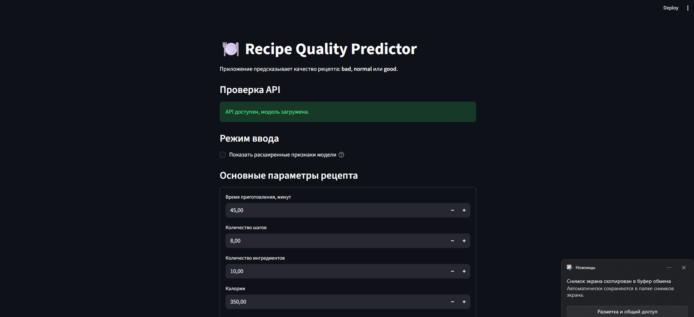
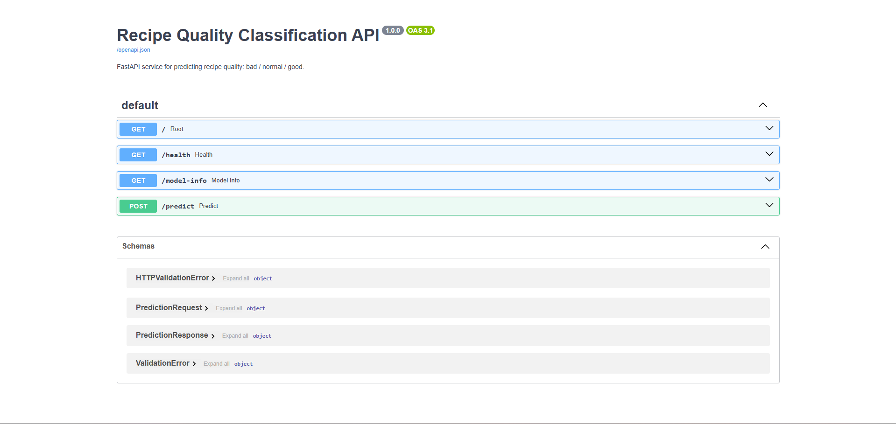

# Отчёт по ML-проекту: классификация качества рецептов

**Студент:** Брехов Виталий Игоревич  
**Группа:** БИВ237  

## 1. Введение и постановка задачи. Обоснование метрики качества

В проекте решается задача классификации качества рецептов по их характеристикам. На вход модели подаются признаки рецепта: время приготовления, число шагов, число ингредиентов, пищевая ценность, длина описания, длина списков ингредиентов и инструкций, а также дополнительные признаки, построенные на их основе.

Целевая переменная имеет три класса:

| Класс | Смысл |
|---|---|
| `bad` | рецепт с относительно низким средним рейтингом |
| `normal` | рецепт со средним качеством |
| `good` | рецепт с относительно высоким средним рейтингом |

Классы строились по среднему рейтингу рецепта. Чтобы разметка была устойчивее, использовались только рецепты, у которых есть не менее 10 пользовательских оценок. После этого рецепты были разбиты по квантилям среднего рейтинга: нижние 30% — `bad`, средние 40% — `normal`, верхние 30% — `good`.

Основная метрика качества — `macro F1`. Я выбрал её потому, что задача многоклассовая, и важно учитывать качество модели по каждому классу отдельно. Обычная accuracy может быть неинформативной, если модель хорошо предсказывает только самый частый класс. `macro F1` усредняет F1 по классам без учёта их размера, поэтому лучше показывает, насколько модель справляется со всеми тремя классами. Дополнительно считались `weighted F1` и `balanced accuracy`.

## 2. Поиск и описание данных

Для проекта использовался датасет **Food.com Recipes and User Interactions**. Он выбран потому, что содержит не только информацию о рецептах, но и пользовательские оценки, на основе которых можно построить ML-задачу.

Источник данных:  
<https://www.kaggle.com/datasets/shuyangli94/food-com-recipes-and-user-interactions>

Исходные таблицы:

| Файл | Описание | Размер |
|---|---|---:|
| `RAW_recipes.csv` | данные о рецептах | 231637 строк, 12 столбцов |
| `RAW_interactions.csv` | оценки и отзывы пользователей | 1132367 строк, 5 столбцов |

После очистки:

| Таблица | Размер |
|---|---:|
| `recipes` после очистки | 230542 строки |
| `interactions` после очистки | 1071520 строк |
| итоговая recipe-level таблица после построения таргета | 19965 строк, 52 столбца |

Итоговая выборка подходит под требования проекта: строк больше 10000, признаков больше 10, задача является ML-задачей классификации, а не просто анализом датасета.

## 3. Обработка и подготовка данных

Сначала были загружены две таблицы: рецепты и пользовательские взаимодействия. Затем была выполнена очистка данных.

В таблице рецептов были проверены дубликаты по полной строке и по `recipe_id`. Дубликаты удалялись, числовые поля приводились к числовому типу, дата публикации рецепта приводилась к формату `datetime`. Также удалялись рецепты с некорректными значениями: неположительным временем приготовления, неположительным числом шагов или ингредиентов.

В таблице взаимодействий были удалены дубликаты, поле `rating` было приведено к числовому типу, дата взаимодействия была приведена к формату `datetime`. Также были оставлены только оценки в диапазоне от 1 до 5.

Пропуски были проанализированы отдельно. В рецептах основной пропуск был в `description`, а в interactions — в `review`. Эти пропуски не мешают построению целевой переменной и числовых признаков. Для текстовых признаков пропуски заменялись пустой строкой при расчёте длин.

Выбросы были найдены через IQR. Массово удалять их не стал, потому что в рецептах экстремальные значения могут быть содержательно корректными: например, очень долгое приготовление, высокая калорийность или большое количество сахара. Вместо удаления были добавлены `log1p`-признаки, а в линейных моделях использовался `RobustScaler`, чтобы уменьшить влияние тяжёлых хвостов.

Были построены новые признаки:

| Группа признаков | Примеры |
|---|---|
| структура рецепта | `n_steps`, `n_ingredients`, `minutes_per_step` |
| текстовые длины | `name_len`, `description_len`, `steps_total_text_len` |
| списки | `tags_len`, `ingredients_len`, средняя длина элемента |
| пищевая ценность | `calories`, `sugar_pdv`, `sodium_pdv`, `protein_pdv` |
| производные признаки | `calories_per_ingredient`, `calories_per_step` |
| бинарные признаки | `is_quick_recipe`, `is_long_recipe`, `is_few_ingredients` |
| логарифмические признаки | `log1p_minutes`, `log1p_calories` |
| дата публикации | `submitted_year`, `submitted_month`, `submitted_weekday` |

Чтобы избежать data leakage, признаки `mean_rating`, `median_rating` и `rating_count` использовались только для построения целевой переменной. Они не попадали в `X_base` и `X_full`. Разделение на train, validation и test выполнялось со stratify по целевому классу. Все preprocessing-шаги внутри моделей выполнялись через `sklearn Pipeline`, поэтому imputer и scaler обучались только на train.

Разделение данных:

| Часть | Размер | Назначение |
|---|---:|---|
| train | 13975 строк | обучение моделей |
| validation | 2995 строк | выбор модели и гиперпараметров |
| test | 2995 строк | финальная проверка качества |

Распределение классов после разметки:

| Класс | Количество | Доля |
|---|---:|---:|
| `bad` | 6044 | 0.3027 |
| `normal` | 7917 | 0.3965 |
| `good` | 6004 | 0.3007 |

Классы получились достаточно сбалансированными, поэтому модель не должна обучаться только на один доминирующий класс.

Диапазоны среднего рейтинга по классам:

| Класс | Количество | Минимум | Максимум | Среднее |
|---|---:|---:|---:|---:|
| `bad` | 6044 | 2.1333 | 4.6250 | 4.4028 |
| `normal` | 7917 | 4.6259 | 4.8559 | 4.7505 |
| `good` | 6004 | 4.8571 | 5.0000 | 4.9348 |

## 4. Baseline-модель

Для baseline использовались простые модели на базовом наборе признаков. В baseline не использовался полный feature engineering. Цель baseline — получить нижнюю точку сравнения для более сложных моделей.

Базовые признаки:

```text
minutes, n_steps, n_ingredients, calories, total_fat_pdv, sugar_pdv,
sodium_pdv, protein_pdv, saturated_fat_pdv, carbs_pdv
```

Результаты baseline на validation:

| Модель | Признаки | Macro F1 | Weighted F1 | Balanced Accuracy |
|---|---|---:|---:|---:|
| DummyClassifier | base | 0.1893 | 0.2253 | 0.3333 |
| LogisticRegression | base | 0.3576 | 0.3539 | 0.3694 |
| KNN | base | 0.3716 | 0.3811 | 0.3746 |

DummyClassifier показывает нижнюю границу качества. LogisticRegression и KNN работают лучше dummy, значит в признаках есть полезный сигнал. При этом качество baseline остаётся ограниченным, поэтому дальше были проверены более сильные модели и полный набор признаков.

## 5. Эксперименты

В основной части экспериментов использовался полный набор из 38 признаков. Проверялись разные семейства моделей и разные гиперпараметры. Всего было проведено 83 эксперимента.

### Эксперимент 1. Проверить, помогает ли полный feature engineering

**Гипотеза:** дополнительные признаки должны улучшить качество по сравнению с базовыми признаками.

**Как проверялось:** сравнивались модели на `base` и `full` признаках.

**Результат:** лучшие модели получились именно на `full` признаках. Это означает, что feature engineering добавил полезную информацию.

### Эксперимент 2. Сравнить разные семейства моделей

**Гипотеза:** ансамблевые модели должны работать лучше линейных моделей и KNN, потому что признаки имеют нелинейные зависимости.

**Как проверялось:** были обучены LogisticRegression, KNN, RandomForest, ExtraTrees и HistGradientBoosting.

Лучшие модели по семействам на validation:

| family       | experiment              | feature_set   |   n_features | params                                               |   macro_f1 |   weighted_f1 |   balanced_accuracy |
|:-------------|:------------------------|:--------------|-------------:|:-----------------------------------------------------|-----------:|--------------:|--------------------:|
| RandomForest | RF_full_d20_l10_mfsqrt  | full          |           38 | max_depth=20, max_features=sqrt, min_samples_leaf=10 |     0.4217 |        0.4238 |              0.4217 |
| ExtraTrees   | ET_full_d20_l3_mfsqrt   | full          |           38 | max_depth=20, max_features=sqrt, min_samples_leaf=3  |     0.407  |        0.41   |              0.4069 |
| HistGB       | HGB_full_lr0.1_d8_l40   | full          |           38 | learning_rate=0.1, max_depth=8, min_samples_leaf=40  |     0.4061 |        0.4172 |              0.4137 |
| KNN          | KNN_full_k35_distance   | full          |           38 | n_neighbors=35, weights=distance                     |     0.3886 |        0.4004 |              0.3958 |
| LogReg       | LogReg_full_C1.0        | full          |           38 | C=1.0                                                |     0.378  |        0.372  |              0.394  |
| KNN_PCA      | KNN_full_PCA_5_k15      | full          |           38 | n_neighbors=15, pca_n_components=5, weights=distance |     0.3601 |        0.3708 |              0.3641 |
| LogReg_PCA   | LogReg_full_PCA_10_C1.0 | full          |           38 | C=1.0, pca_n_components=10                           |     0.3343 |        0.3236 |              0.3643 |
| Dummy        | Dummy_base              | base          |           10 | -                                                    |     0.1893 |        0.2253 |              0.3333 |

Ансамблевые модели оказались сильнее линейной модели и KNN. Лучшим семейством стал RandomForest.

### Эксперимент 3. Подбор гиперпараметров RandomForest

**Гипотеза:** ограничение глубины дерева и увеличение `min_samples_leaf` могут снизить переобучение и улучшить качество.

**Как проверялось:** перебирались `max_depth`, `min_samples_leaf` и `max_features`.

Топ-5 экспериментов на validation:

| experiment             | family       | params                                               |   macro_f1 |   weighted_f1 |   balanced_accuracy |
|:-----------------------|:-------------|:-----------------------------------------------------|-----------:|--------------:|--------------------:|
| RF_full_d20_l10_mfsqrt | RandomForest | max_depth=20, max_features=sqrt, min_samples_leaf=10 |     0.4217 |        0.4238 |              0.4217 |
| RF_full_d20_l10_mf0.7  | RandomForest | max_depth=20, max_features=0.7, min_samples_leaf=10  |     0.4207 |        0.4232 |              0.4205 |
| RF_full_d10_l10_mfsqrt | RandomForest | max_depth=10, max_features=sqrt, min_samples_leaf=10 |     0.4165 |        0.4151 |              0.4212 |
| RF_full_d20_l5_mfsqrt  | RandomForest | max_depth=20, max_features=sqrt, min_samples_leaf=5  |     0.416  |        0.4216 |              0.4163 |
| RF_full_d10_l3_mfsqrt  | RandomForest | max_depth=10, max_features=sqrt, min_samples_leaf=3  |     0.4148 |        0.4144 |              0.4175 |

Лучший результат дал RandomForest с `max_depth=20`, `max_features=sqrt`, `min_samples_leaf=10`.

### Эксперимент 4. Уменьшение размерности через PCA

**Гипотеза:** PCA может убрать шум и улучшить качество линейных моделей или KNN.

**Как проверялось:** запускались LogisticRegression и KNN после PCA с разным числом компонент.

**Результат:** PCA не улучшил качество. Лучшие PCA-варианты были слабее моделей без PCA. Поэтому финальная модель использует полный набор признаков без уменьшения размерности.

### Эксперимент 5. Ablation study

**Гипотеза:** разные группы признаков дают разный вклад в качество модели.

**Как проверялось:** финальная модель обучалась на разных поднаборах признаков: полный набор, без nutrition-признаков, без текстово-структурных признаков, без признаков даты, только complexity-признаки, только nutrition-признаки и только text-structure признаки.

Результаты ablation study:

| feature_group          |   n_features |   macro_f1 |   weighted_f1 |   balanced_accuracy |
|:-----------------------|-------------:|-----------:|--------------:|--------------------:|
| full                   |           38 |     0.4217 |        0.4238 |              0.4217 |
| without_text_structure |           22 |     0.4063 |        0.4062 |              0.4095 |
| without_nutrition      |           28 |     0.4024 |        0.4055 |              0.4034 |
| without_date           |           35 |     0.3917 |        0.3934 |              0.3917 |
| nutrition_only         |           10 |     0.3905 |        0.3902 |              0.3931 |
| text_structure_only    |           16 |     0.3788 |        0.3816 |              0.3789 |
| complexity_only        |            9 |     0.3681 |        0.3679 |              0.3713 |

Лучший результат ожидаемо получился на полном наборе признаков. Если убрать текстово-структурные признаки, качество падает умеренно: `macro F1` снижается с 0.4217 до 0.4063. Если убрать признаки пищевой ценности, качество снижается до 0.4024. Самые слабые отдельные группы — только complexity-признаки и только text-structure признаки. Это показывает, что модель использует несколько разных групп признаков, а не опирается только на один тип информации.

## 6. Финальная модель + интерпретируемость результатов

Финальной моделью выбран RandomForestClassifier со следующими параметрами:

```text
max_depth = 20
max_features = sqrt
min_samples_leaf = 10
```

Модель выбрана потому, что она показала лучший `macro F1` на validation и почти не потеряла качество на test. Это говорит о том, что модель не переобучилась сильно на validation.

Результаты финальной модели на test:

| Модель | Macro F1 | Weighted F1 | Balanced Accuracy |
|---|---:|---:|---:|
| RandomForestClassifier | 0.4189 | 0.4199 | 0.4188 |

Качество по классам на test:

| Класс | Precision | Recall | F1-score |
|---|---:|---:|---:|
| bad | 0.4248 | 0.3925 | 0.4080 |
| normal | 0.4257 | 0.4322 | 0.4289 |
| good | 0.4086 | 0.4317 | 0.4199 |

Модель предсказывает все три класса примерно на одном уровне. Это важно, потому что задача не сводится к нахождению только одного самого частого класса.

Для интерпретируемости использовалась важность признаков RandomForest. Топ-10 признаков:

| feature                    |   importance |
|:---------------------------|-------------:|
| submitted_year             |       0.0445 |
| ingredients_avg_item_len   |       0.0381 |
| protein_pdv                |       0.038  |
| steps_avg_item_len         |       0.038  |
| tags_avg_item_len          |       0.0373 |
| tags_total_text_len        |       0.0366 |
| sugar_pdv                  |       0.0355 |
| minutes_per_step           |       0.0335 |
| steps_total_text_len       |       0.0329 |
| log1p_steps_total_text_len |       0.0327 |

По важности признаков видно, что модель использует не один конкретный столбец, а смесь разных типов признаков: дату публикации, среднюю длину ингредиентов и шагов, пищевую ценность, длину тегов и производные признаки вроде `minutes_per_step`. Это согласуется с результатами ablation study: качество лучше всего получается тогда, когда модель видит полный набор признаков.

## 7. Деплой

Для деплоя реализованы два сценария через Docker Compose.

Первый сценарий — полный цикл обучения. Контейнер читает данные из `data/raw`, выполняет очистку, feature engineering, обучение моделей, подбор гиперпараметров и сохраняет артефакты в `data/processed` и `models`.

Команда:

```bash
docker compose --profile train up --build trainer
```

Второй сценарий — запуск готовой модели как сервиса. В этом режиме модель не переобучается, а загружается из `models/best_model.joblib`. Поднимаются два сервиса:

| Сервис | Назначение | Адрес |
|---|---|---|
| FastAPI | API для запросов к модели | `http://127.0.0.1:8000/docs` |
| Streamlit | пользовательский интерфейс | `http://127.0.0.1:8501` |

Команда:

```bash
docker compose --profile deploy up --build
```

FastAPI содержит endpoint `/predict`, куда можно отправить признаки рецепта и получить предсказанный класс. Streamlit позволяет сделать то же самое через простой интерфейс.

Проверка API:

```powershell
Invoke-RestMethod -Uri http://127.0.0.1:8000/health
```

Пример запроса:

```powershell
$body = @{
    features = @{
        minutes = 45
        n_steps = 8
        n_ingredients = 10
        calories = 350
        total_fat_pdv = 20
        sugar_pdv = 10
        sodium_pdv = 15
        protein_pdv = 12
        saturated_fat_pdv = 8
        carbs_pdv = 14
    }
} | ConvertTo-Json -Depth 4

Invoke-RestMethod -Uri http://127.0.0.1:8000/predict `
    -Method Post `
    -Body $body `
    -ContentType "application/json"
```

Скриншоты деплоя:





Видео работы деплоя: `[вставить ссылку на видео]`

## 8. Заключение и выводы

В проекте была построена ML-задача классификации качества рецептов на основе данных Food.com. Были загружены и очищены исходные данные, построена целевая переменная, выполнен feature engineering и проведены эксперименты с несколькими семействами моделей.

Лучший результат показала модель RandomForestClassifier. Она превзошла baseline-модели и показала стабильное качество на test. Основная метрика `macro F1` на test составила 0.4189.

Качество модели нельзя назвать идеальным, но это ожидаемо: пользовательская оценка рецепта зависит не только от структурных признаков, но и от вкуса, качества текста, фотографий, личных предпочтений пользователя и других факторов, которых нет в датасете. Тем не менее модель показывает качество выше baseline и предсказывает все три класса без сильного перекоса.

Для воспроизводимости добавлены фиксированные seed, модульная структура проекта, тесты, линтер, Docker и Docker Compose. Для деплоя реализованы FastAPI и Streamlit, которые позволяют использовать обученную модель без повторного запуска обучения.
